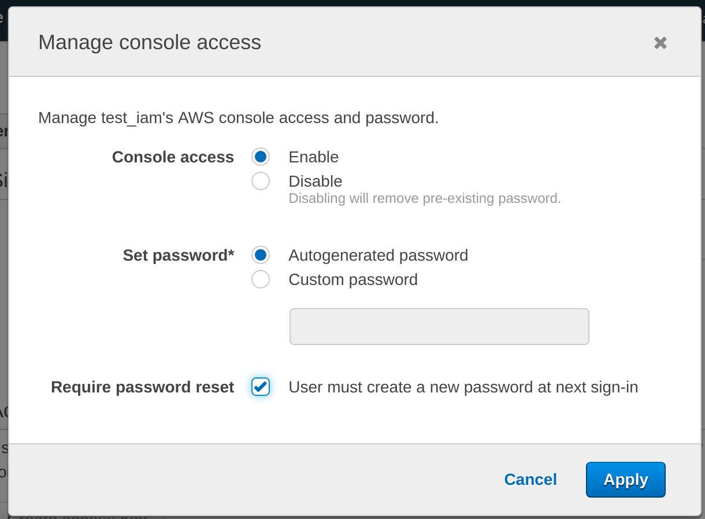

# IAM

Manage Data.gov sandbox access through Infrastructure as Code.


## Goals

- Manage IAM users and access using Infrastructure as Code
- Consolidate policy definitions in a single, easy to audit, location
- Manage both human users and machine accounts
- Automatically apply changes through GH workflow


## Features

- Enforce MFA on all human users
- Create machine accounts for continuous deployment
- New users can sign in with temporary password


## Usage


### New users

Create a new user module within `users.tf`. You can copy from an existing
resource. Make sure the user is in the `developers` group which enforces MFA.

```
module "firstname_lastname" {
  source  = "./user"
  name = "firstname.lastname@gsa.gov"
  groups = ["developers"]
}
```

Once applied, log into IAM to enable console access and set a temporary password
for the user.



At this point, the user can login with the temporary password. From the AWS
console, click their username -> My Security Credentials. They will have to
enable MFA and change their password before they can do anything else.

_Note: the new user may have to sign out and back in again._


### Removing a user

Remove the user's entry from `users.tf`.
